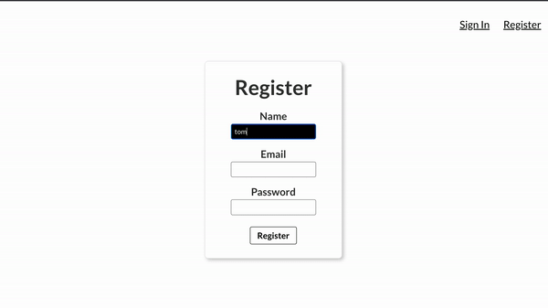

### Summary 
This is a simple React app for face-detection with login and sign up functions.

[face-detection demo](https://clarifai-detect-app-front-end.herokuapp.com/)

### Technologies

Front-end: React/Tachyons

Back-end: Express/knex/PostgreSQL

Face detection API: Clarifai

### `npm start`

Runs the app in the development mode.\
Open [http://localhost:3000](http://localhost:3000) to view it in your browser.
